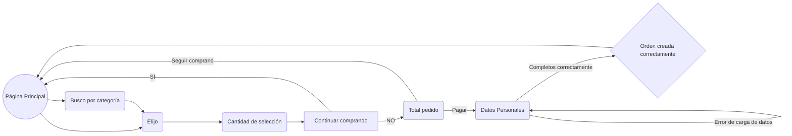
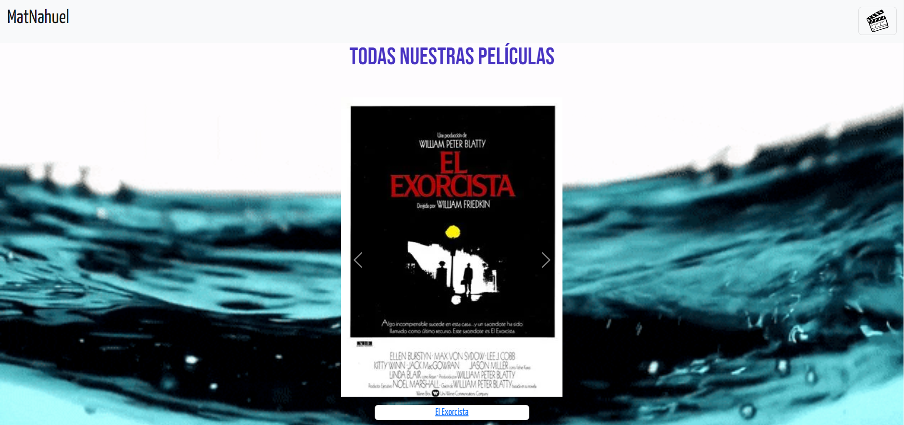
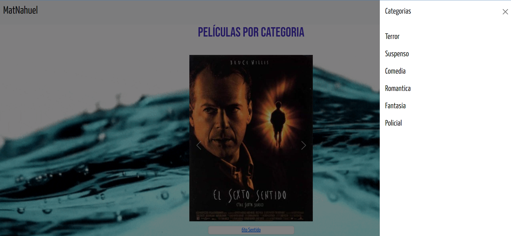
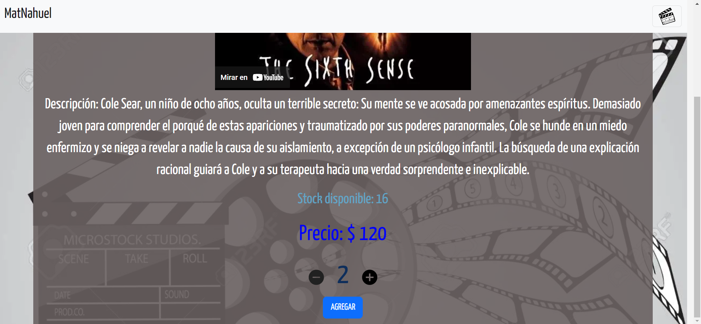
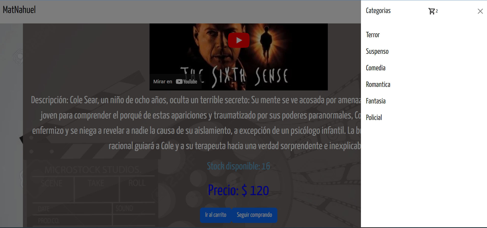
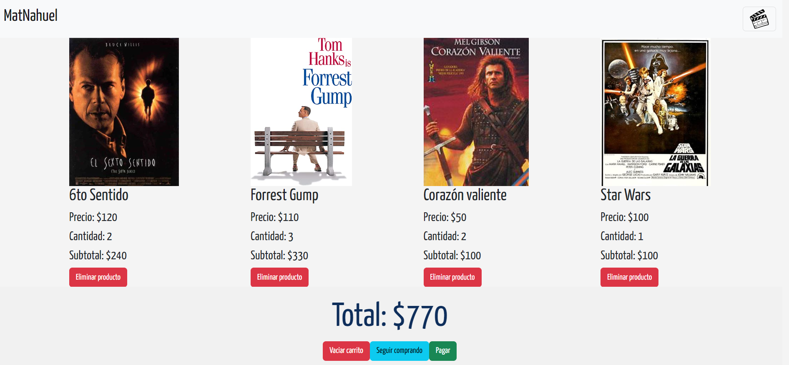
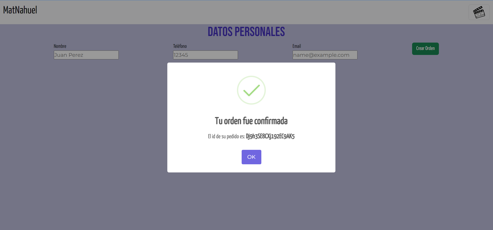

# Ecommerce ReactJS - CODERHOUSE
## Quién soy?

Mi nombre es **Matías Nahuel IERACE** y esta es mi entrega final del curso de **ReactJS** en **CODERHOUSE**
## Flujo de la página

## Video GIF demostración del proyecto

## Capturas del proyecto

  

  

  

  

 

## Datos

-   **Estudiante:**  Matias Nahuel IERACE
    
-   **LinkedIn:**  [https://www.linkedin.com/in/mat%C3%ADas-nahuel-ierace-22276a175/](https://www.linkedin.com/in/mat%C3%ADas-nahuel-ierace-22276a175/)
    
-   **GitHub:**  [https://github.com/matnahuel23/entregaFinalReactIERACE.git](https://github.com/matnahuel23/entregaFinalReactIERACE.git)
    
-   **Curso:**  React JS / Coderhouse
    
-   **Comisión:**  43180
    
-   **Profesor:**  Adrián Escalante
    
-   **Tutor:**  Pablo Moraga
    
-   **Puedes ver el Proyecto en Vercel:  [https://entrega-final-react-ierace.vercel.app/](https://entrega-final-react-ierace.vercel.app/)  **

### Frontend

-   **React.js**

### Frontend

-   **Firestore**

### Librerías

-   **Google fonts**
-   **Sweetalert**
-   **Toastify**
-   **Bootstrap**

### Control de código fuente

-   **git**

----------

QUE LA FUERZA NOS ACOMPAÑE y gracias por leer hasta aca!!